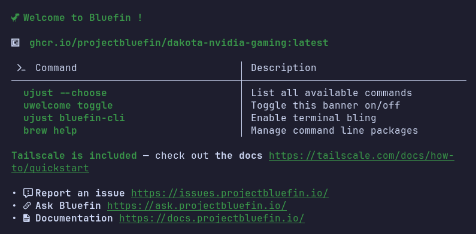

# uWelcome



*uWelcome is a configurable CLI Banner made for your favorite Linux systems!*

⚠️ **WIP**: Some features still need feedback and testing.

**Contributions are welcome!** If you want to contribute, you're welcome to submit a pull request or [open an issue](https://github.com/projectbluefin/uwelcome/issues) - it's very much appreciated ❤️

Want to configure or contribute to uWelcome ? Take a look at the [documentation](https://github.com/projectbluefin/uwelcome/tree/main/docs) !

> Interessed in the translatable system MOTD instead ? Check [umotd](https://github.com/projectbluefin/umotd)

## Roadmap

Here are features that are planned for the future:

- System message slot for displaying a message following a script or such (not randomized) [Maybe ?]

## How to try

### Download it from the releases page

You can download the latest release from the [releases page](https://github.com/projectbluefin/uwelcome/releases).

You can then rename it to `uwelcome` and place it in your usual `/bin` folder.

> Note: You won't receive automatic updates, you will have to download uWelcome at each new release.

### Compile from source

You'll need to have [`go`](https://repology.org/project/go/versions) installed on your system to compile uWelcome from source.

Then you'll have to simply clone the repository and then build the binary:

```sh
git clone https://github.com/projectbluefin/uwelcome
cd uwelcome
go build
./uwelcome
```

You'll then have the `uwelcome` binary in the current directory, which you can just drop into your usual `/bin` folder and it will work without any further setup (except for the configuration file if you want to customize it).

## Commands

uWelcome supports the following commands (for now):

```yml
disable:    Disables the MOTD for the user
edit:       Opens the config file with the default terminal editor
enable:     Enables the MOTD for the user
reset:      Resets the config file to the default/system config
status:     Prints the config file currently in use
toggle:     Toggles the MOTD on/off for the current user
version:    Displays the version of uWelcome currently in use
```

Learn more in the [docs folder](https://github.com/projectbluefin/uwelcome/tree/main/docs) !

## AI usage

This project had mild AI involvement mainly for auto-completion and code checking.
The program is always tested before release, no worries. (I have standards >:3)

[](https://www.realgoodai.org/real-rating)
